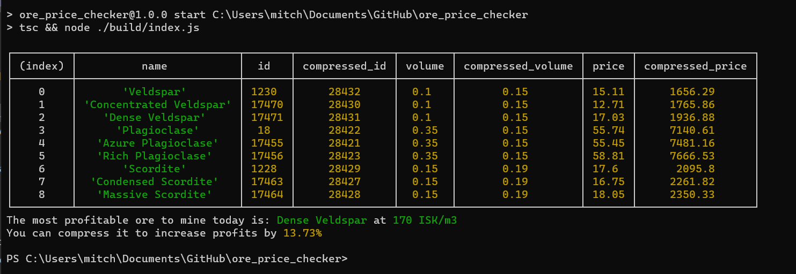

# EVE Online Highsec ore price checker

Determines the most profitable HighSec ore to mine in EVE online using the [EVEMarketer](https://evemarketer.com/) API.



## How to run the app:
Pick the region by specifying the trade hub.  
Subsitute `jita` with `amarr`, `hek`, `dodixie`, or `rens`.
```bash
# Using docker
docker run -it --rm ghcr.io/mitchfen/eve_ore_price_checker:latest jita
```

```bash
# Or using npm
npm install
npm run build
npm run check jita
```
