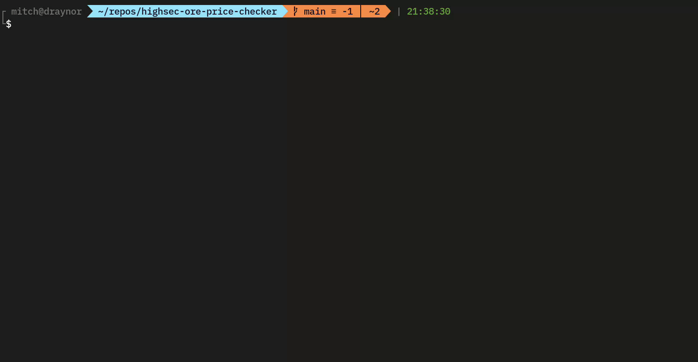

[](https://github.com/mitchfen/eve_ore_price_checker/actions/workflows/publishContainer.yaml)
# Highsec ore price checker

This console app queries the [EVEMarketer](https://evemarketer.com/) API to determine the most profitable HighSec ore to mine in EVE online.  
It also calculates whether compressing the ore will increase profits, and by how much.

## Example: 


## How to run the app:
Pick the region by specifying tone of the four major trade hubs.  
The default is `jita`, but you can also specify `amarr`, `hek`, `dodixie`, or `rens`.

```bash
# Run using npm
npm install
npm run buildAndCheck jita
```

```bash
# Run using docker (This will pull the ~190MB container image)
docker run -it --rm ghcr.io/mitchfen/highsec-ore-price-checker:latest jita
```
